# Star Views Webpage
The Star View website is made for everyone who has an intrest in stars or would like to get intrested in the subject.

Users will discover new ideas about what a star can be and learn new things and new theories to make the user think.
[Star Views](https://savvietarmac.github.io/p1-star-views/survey.html)

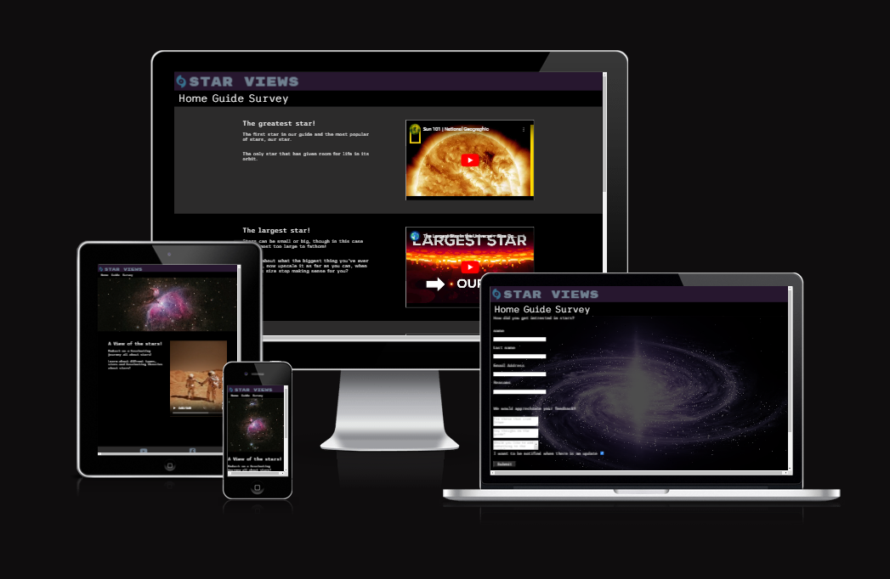

## User Stories

 |Story no. |Story|
 | -------- | -------- |
 |1|As a new user,  I want to further my intrest in stars.  So that i can develop or further such an intrest.  I know i am done when the user can navigate from the homepage to the guide.|
 |2|As a new user,  I want to go to the guide. So i can learn something intresting.  I know i am done when new users has content to consume and learn from in the guide.|
 |3|As a new user,  I want to continue to the survey. So i can give feedback on the website and what i want to see added.  i know i am done when a new user can navigate to the survey page and submit it.|
 |4|As a user, I want to be able to learn if the guide has been updated. So the user can be incentivized to return.  I know i am done when there is an option to accept updates.|

 ***

## Wireframes 
Bellow are my early designs for the Star Views web project.

### Index Page
##### Widescreen
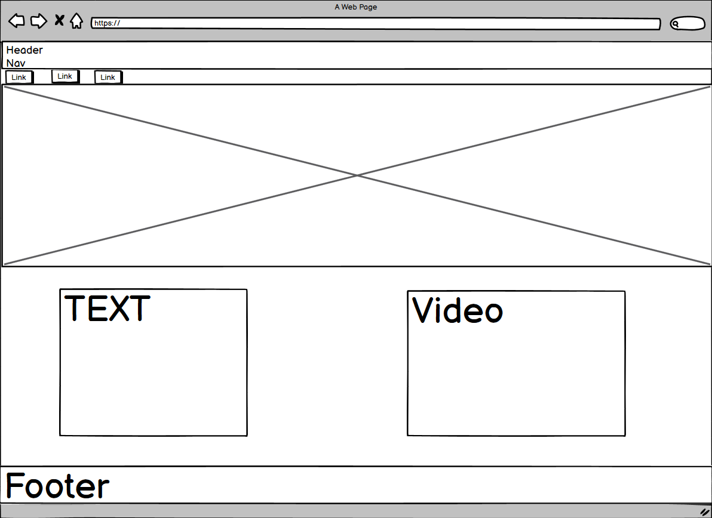
##### Phone
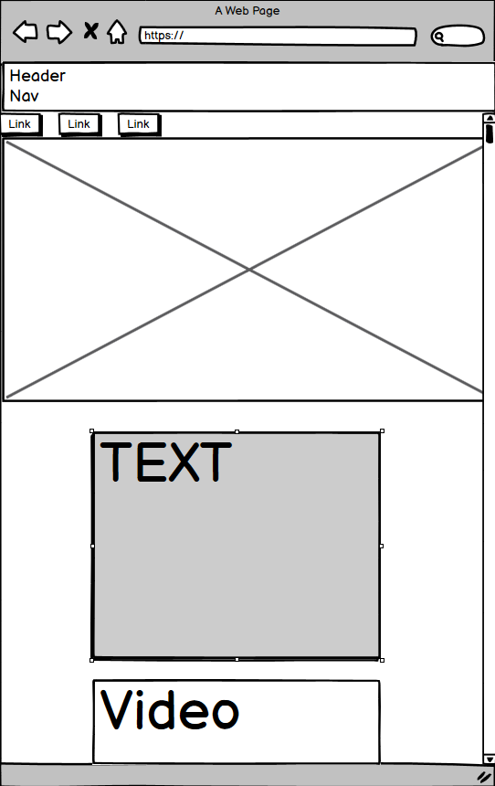

### Guide Page
##### Widescreen
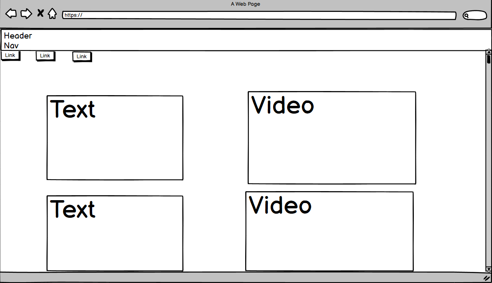
##### Phone
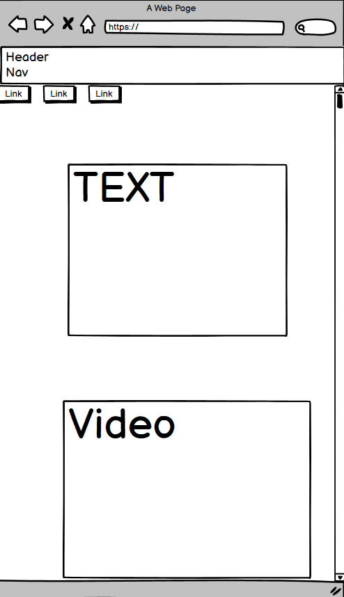

### Survey Page
##### Widescreen
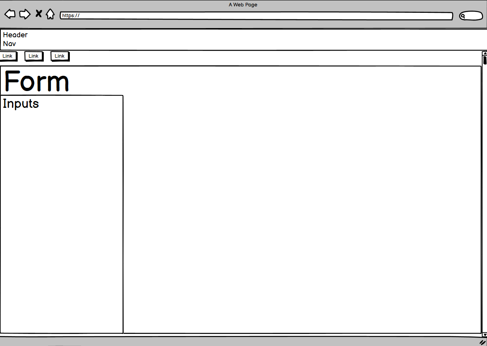
##### Phone
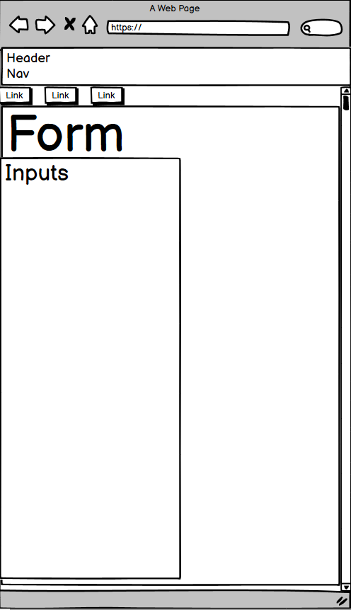

***

## Features
- __All pages__
  - The website has the name of the website in the header on all pages.
  - The website has links to the rest of the webpage at the top in the nav.
  - The website also has and shows a purple background if you mouse over the nav links. 
  - The website has a footer with links at the bottom in all pages.
  - The website has an icon in the top left that acts as an additional link to the index.
  - The website has been made responsive to diffrent screensizes.
 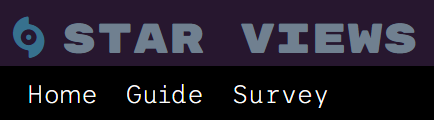
 ##### Footer
 

- __Colors__ 
  - Colors for the website 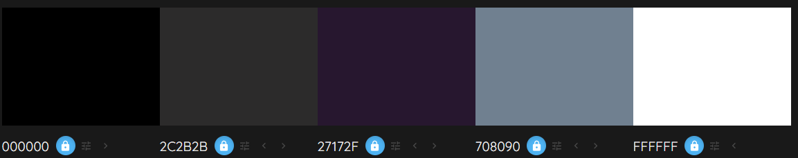

- __Index__
  - The index page has an explanation as to the purpose of the webpage.
  - The index has a playable video.
  - The index page has a hero image.
 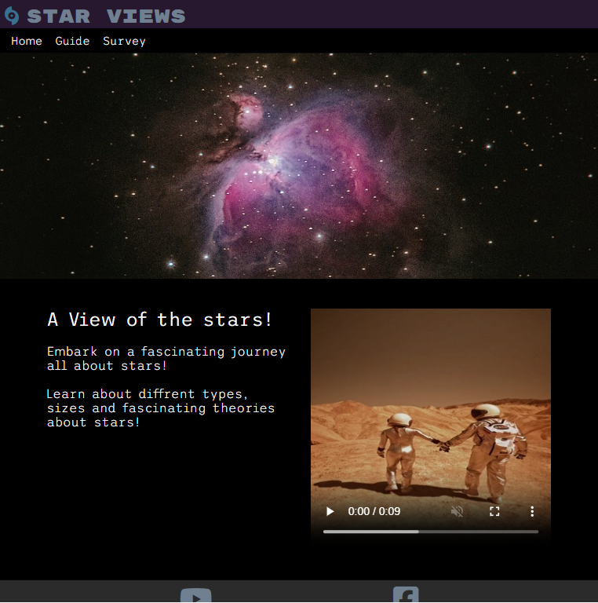

 - __Guide__
    - The guide page has text to introduce a number of star related statments of intrest to the user.
    - The guide has multiple Iframes from youtube with which the user can interact with.
    - The guide has alternating color-backgrounds to keep the viewers attention.
  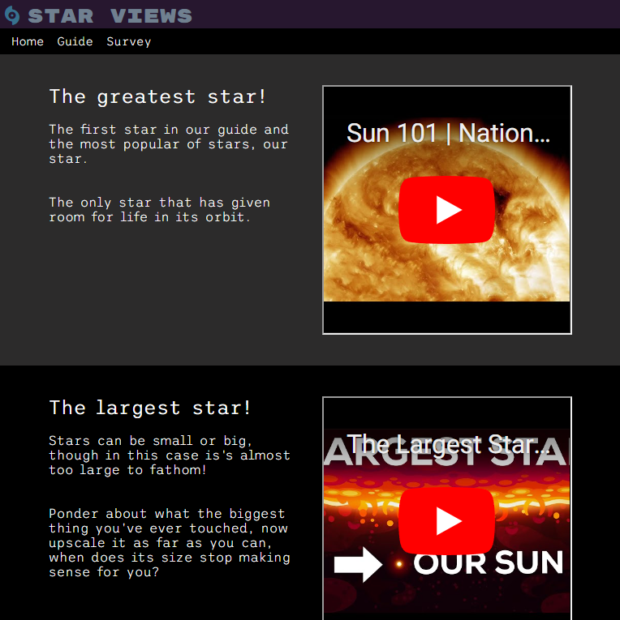

 - __Survey__
    - The survey page has a form for the user to fill concerning how they discovered the website.
    - The survey has multiple textareas for the user to give feedback on the website.
    - The survey pages input at the bottom submits the page and sends it.
    - The survey has a autoplay video in the background to make the website more intresting.
 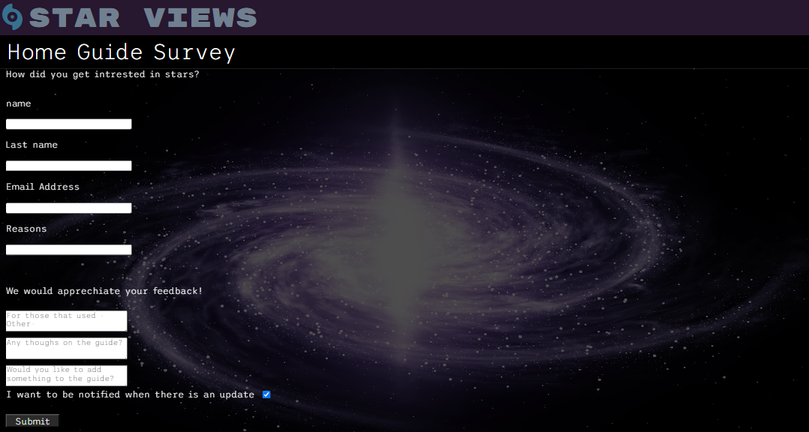

- __Form Feedback__
  - Using [Form Dump](https://formdump.codeinstitute.net/) the form looks like this when checked using the input.   
  - The form has a link instead for now as to keep the user on the page instead as i can not yet make my own form dump since i have not yet learned JavaScript.

- __Thank you__
  - The Thank You page keeps the user on the website as opposed to going to the formdump.
  - The formdump submit button can be accessed by turning the visiblity and display of the button to visible.
 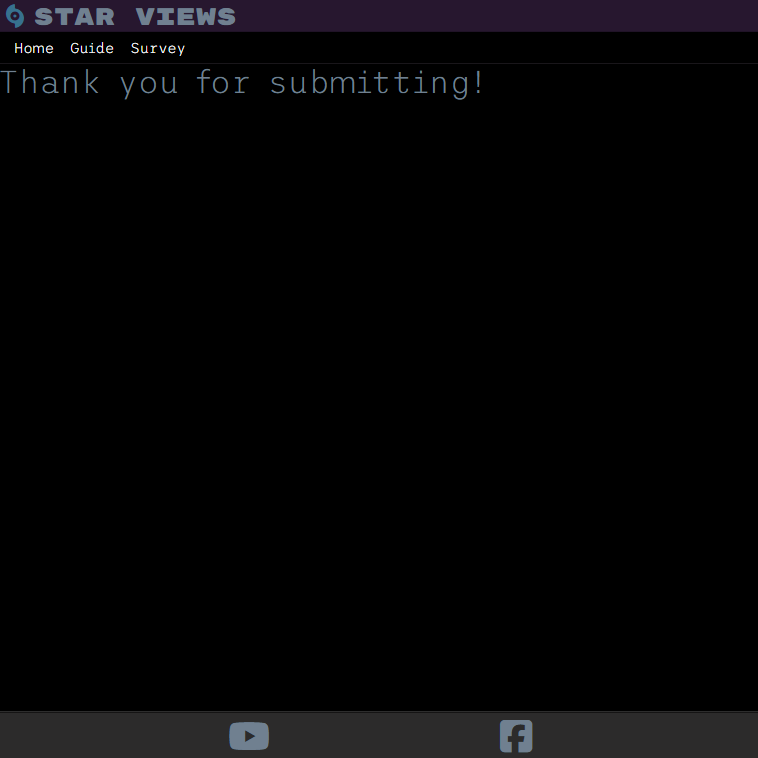

***

## Testing

### validator Testing

 - HTML
    - Index: No errors were found using the official W3C validator https://validator.w3.org/nu/?doc=https%3A%2F%2Fsavvietarmac.github.io%2Fp1-star-views%2Findex.html
    - Guide: No errors were found using the official W3C validator https://validator.w3.org/nu/?doc=https%3A%2F%2Fsavvietarmac.github.io%2Fp1-star-views%2Fguide.html
    - Survey: No errors were found using the official W3C validator https://validator.w3.org/nu/?doc=https%3A%2F%2Fsavvietarmac.github.io%2Fp1-star-views%2Fsurvey.html
    - Thank-you: No errors were found using the official W3C validator https://validator.w3.org/nu/?doc=https%3A%2F%2Fsavvietarmac.github.io%2Fp1-star-views%2Fthank-you.html
 - CSS 
    - No errors were found using the official jigsaw validator http://jigsaw.w3.org/css-validator/validator?lang=en&profile=css3svg&uri=https%3A%2F%2Fsavvietarmac.github.io%2Fp1-star-views%2Fthank-you.html&usermedium=all&vextwarning=&warning=1

### User Stories Testing

 | Story no. | Result | Story/evidence |
 | -------- | -------- | ---------- |
 |1|Test Pass|As a new user,  I want to further my intrest in stars.  So that i can develop or further such an intrest.  I know i am done when the user can navigate from the homepage to the guide.  Evidence: Navigation links for the website.   |
 |2|Test Pass|As a new user,  I want to go to the guide. So i can learn something intresting.  I know i am done when new users has content to consume and learn from in the guide.  Evidence: The guide is full of content to consume.  |
 |3|Test Pass|As a new user,  I want to continue to the survey. So i can give feedback on the website and what i want to see added.  i know i am done when a new user can navigate to the survey page and submit it. Evidence: A submit button exists that works, note: decided to make the button a link instead of a submit to improve the website.  |
 |4|Test Pass|As a user, I want to be able to learn if the guide has been updated. So the user can be incentivized to return.  I know i am done when there is an option to accept updates.  Evidence: There exists a checkbox in the survey for this exact purpose.  | 

### Accessiblity Testing

Using lighthouse to rate the accesability of the webpage. Results are:

 
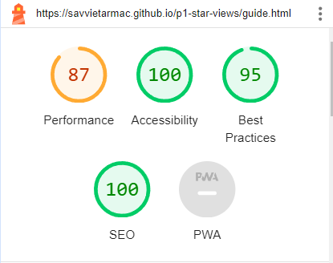 
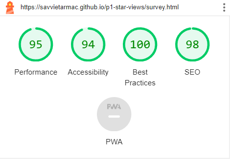 
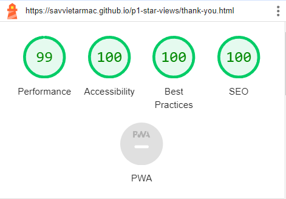 

### Manual Testing'
 - I have tested this website on diffrent web browsers.
 - I have tested that the website is responsive to diffrent screen sizes. It works in multiple diffrent screen sizes.
 - I have tested the links in the header, footer and the survey page. they all work
 - I have tested the text and its fonts are readable and scroll where necessary.
 - I have checked that the form sends the data to the correct place when submitted.

#### Desktop
|chrome 121.0.6167.139|Firefox 122.0|
| --- | --- |
|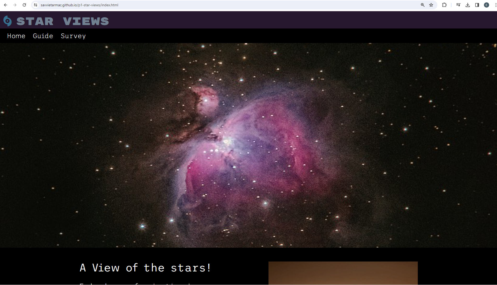|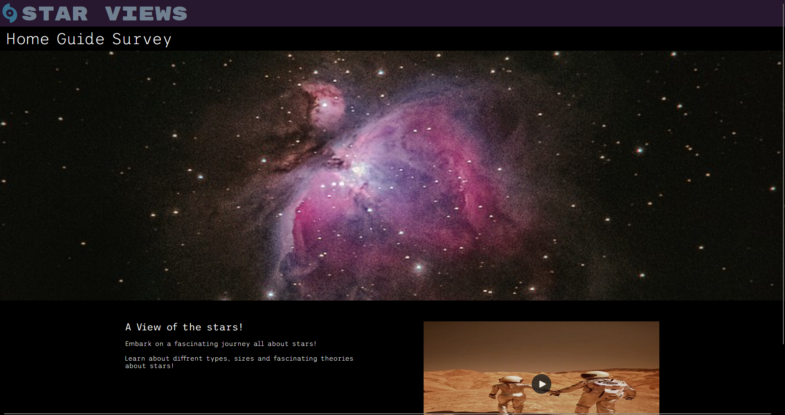|

#### Tablet
|chrome 121.0.6167.139|Firefox 122.0|
| --- | --- |
|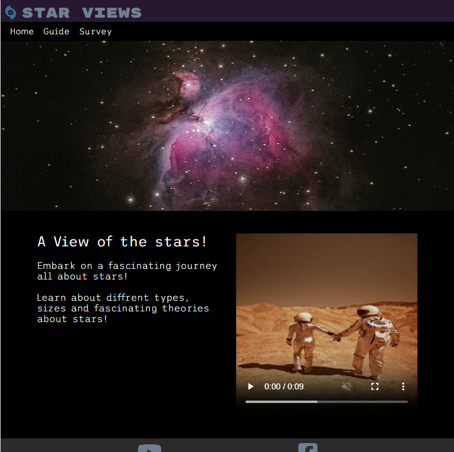|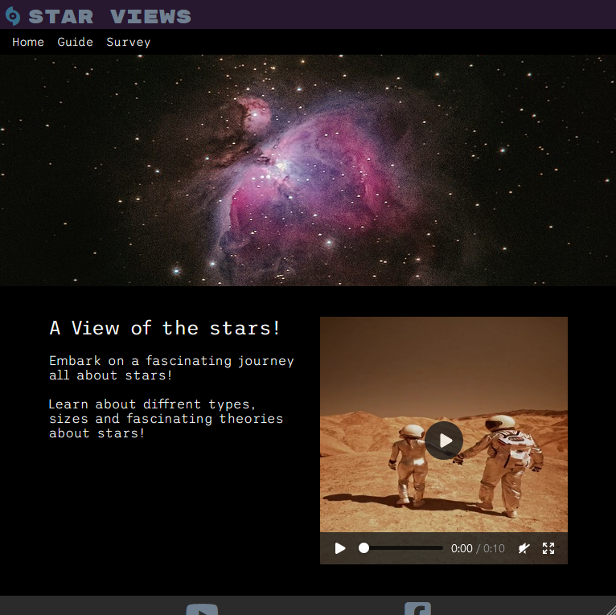|

#### Phone
|chrome 121.0.6167.139|Firefox 122.0|
| --- | --- |
|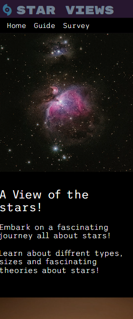|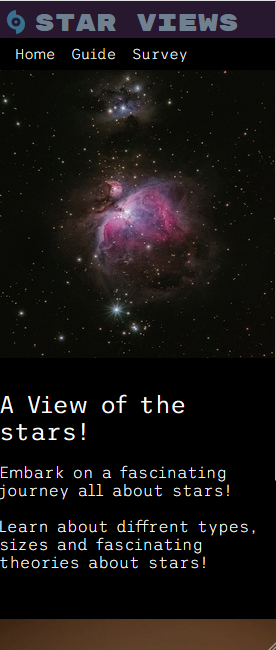|

### Fixed Bugs

#### Widescreen Whitespace Bug
 - On larger screens the right side of the page had a horizontal slider that created unwanted whitespace.
 - Tried fixing by standardizing usage of 100% instead of 100vw in css, did not solve issue but helped in guide.html by making the gray background not be wider than wanted.
 - Finally fixed issue using overflow-x: hidden; in body in CSS which solved the issue.
 - Later changed to oveflow: auto; instead as overflow hidden caused other issues

#### Sideways Screens Bug
 - On mobile the webpage suffered sizing related issues when a smaler screen turned sideways.
 - Has since been fixed using a new media querie for screens of 653px wide.

## Deployment

### Cloning & Forking
#### Fork
1. On GitHub.com, navigate to the [Savvietarmac/p1-star-views](https://github.com/Savvietarmac/p1-star-views) repository.
2. In the top-right corner of the page, click Fork.
3. By default, forks are named the same as their parent repositories. You can change the name of the 
4. fork to distinguish it further.
5. Add a description to your fork.
6. Click Create fork.

#### Clone
1. Above the list of files click the button that says 'Code'.
2. Copy the URL for the repository.
3. Open Terminal. Change the directory to the location where you want the cloned directory.
4. Type git clone, and then paste the URL
5. Press Enter.

### Local Deployment
1. Sign up to [Gitpod](https://github.io/)
2. Download the Gitpod browser extension.
3. On GitHub.com, navigate to the [Savvietarmac/p1-star-views](https://github.com/Savvietarmac/p1-star-views) repository. 
4. Above the list of files click the button that says 'Gitpod'.

### Remote Deployment
1. The site was deployed to Github pages. If you have forked/cloned the repository the steps to deploy are:
2. On GitHub.com, navigate to your repository.
3. Navigate to the settings tab.
4. Click on the tab called 'pages' on the left hand side.
5. From the source drop down list under the heading Build and deployment, select main.
6. The page will hten provide the link to the website.

The live link can be found here - [Star views](https://github.com/Savvietarmac/p1-star-views)

***

## Credits

### Content
 - Used love running as an example for how to create a header and footer. [CI Love Running](https://github.com/Code-Institute-Solutions/love-running-v3/tree/main/3.6-making-the-header-responsive)
 - Used [Colormind](http://colormind.io/bootstrap/) to decide matching colors.
 - Used [Wc3schools](https://www.w3schools.com/howto/howto_css_fullscreen_video.asp) to learn how to make the video background in the survey page.
 - used the LPSB-Learn-GCSE-CS README for help in structuring my own README. [link](https://github.com/dlhamilton/LPSB-Learn-GCSE-CS)

### Media

#### Images
 - Hero image made by Alex Andrews [Pexels](https://www.pexels.com/) pexels-alex-andrews-816608-edited.jpg
 - Used [Pixlr](https://pixlr.com/) for sizing images

#### Icons
 - Favicons taken from [Favicon](https://favicon.io/favicon-converter/)
 - Icons taken from [Fontawesome](https://fontawesome.com/)

#### Videos
 - Astronaut video made by Lisa Fotios taken from [Pexels](https://www.pexels.com/) 2-astronauts.mp4 
 - Video of galaxy made by Samphan Korwong taken from [Pexels](https://www.pexels.com/video/illustration-of-a-galaxy-6961824/) galaxy.mp4 
 - First video in guide https://www.youtube.com/watch?v=2HoTK_Gqi2Q made by National Geographic.
 - Second video in guide https://www.youtube.com/watch?v=3mnSDifDSxQ made by Kurgezagt.
 - Third video in guide https://www.youtube.com/watch?v=udFxKZRyQt4 made by Kurgezagt.
 - Fourth video in guide https://www.youtube.com/watch?v=aeWyp2vXxqA&t=609s made by Kurgezagt.
 - Fifth in guide https://www.youtube.com/watch?v=mIEcpOIfvuk made by The Secrets of the Universe.
