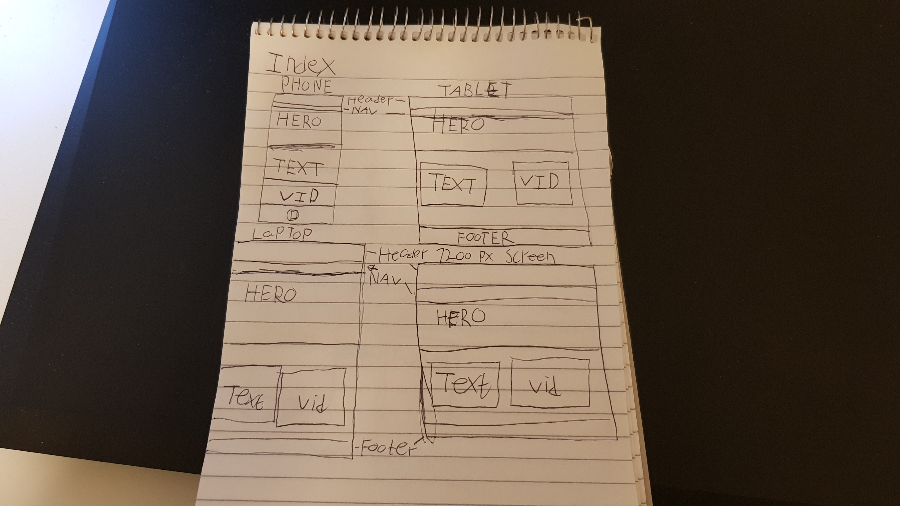
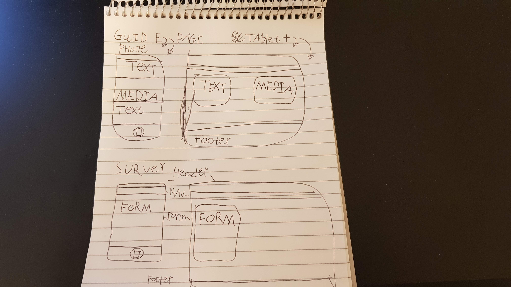

# Star Views Webpage
The Star View website is made for everyone who has an intrest in stars or would like to get intrested in the subject.

Users will discover new ideas about what a star can be and learn new things and new theories to make the user think.
[Star Views](**)

** add https://ui.dev/amiresponsive?url=https://savvietarmac.github.io/p1-star-views/ image **

## User Stories

 |Story no.|Story|
 | --------| --------|
 [1]As a new user,  I want to further my intrest in stars.  So that i can develop or further such an intrest.  I know i am done when the user can navigate from the homepage to the guide.
 [2]As a new user,  I want to go to the guide. So i can learn something intresting.  I know i am done when new users has content to consume and learn from in the guide.
 [3]As a new user,  I want to continue to the survey. So i can give feedback on the website and what i want to see added.  i know i am done when a new user can navigete to the survey page and submit it.
 **[4]As a new user,     
 [5]As a user, I want to be able to share the guide. So that the users can share intrests with others.  I know i am done when a user introduces a new user to the website.

 ***

## Wireframes 
Bellow are my early designs for the Star Views webpage.

### Index Page

### Survey & Guide Pages

***

## Features
- __All pages__
 - The website has the name of the website in the header on all pages.
 - The website has links to the rest of the webpage at the top in the nav.
 - The website has a footer with links at the bottom in all pages.
 - The website has an icon in the top left that acts as an additional link to the index.
 - The website has been made responsive to diffrent screensizes.
 
 

- __Index__
 - The index page has an explenation as to the purpose of the webpage.
 - The index has a playable video.
 - The index page has a hero image.
**

 - __Guide__
  - The guide page has text to introduce a number of star related statments to intrest the user.
  - The guide has multiple Iframes from youtube with which the user can interact with.
  - The guide has alternating color-backgrounds to keep the viewers attention.
  

 - __Survey__
  - The survey page has a form for the user to fill concerning how they discovered the webpage.
  - The survey has multiple textareas for the user to give feedback on the webpage.
  - The survey pages input at the bottom submits the page and sends it.
  - The survey has a autoplay video in the background to make the website more intresting.

***

## Testing

### validator Testing
 - HTML
  - Index: 
  - Guide:
  - Survey:
 - CSS 
  - 

### User Stories Testing

 |Story no.|Story|
 | --------| --------|
 |[1]|As a new user,  I want to further my intrest in stars.  So that i can develop or further such an intrest.  I know i am done when the user can navigate from the homepage to the guide.|
 |[2]|As a new user,  I want to go to the guide. So i can learn something intresting.  I know i am done when new users has content to consume and learn from in the guide.|
 |[3]|As a new user,  I want to continue to the survey. So i can give feedback on the website and what i want to see added.  i know i am done when a new user can navigete to the survey page and submit it.|
 **|[4]|As a new user,     
 |[5]|As a user, I want to be able to share the guide. So that the users can share intrests with others.  I know i am done when a user introduces a new user to the website.|

### Accessiblity Testing

Using lighthouse to rate the accesability of the webpage

### Manual Testing'
 -
 -
 -
 -
 -
 -

### Fixed Bugs

#### Widescreen Whitespace
 - On larger screens the right side of the page had a horizontal slider that created unwanted whitespace.
 - Tried fixing by standardizing usage of 100% instead of 100vw in css, did not solve issue but helped in guide.html by making the gray background not be wider than wanted.
 - Finally fixed issue using overflow-x: hidden; in body in CSS which solved the issue.

#### Sideways Screens
 - On mobile the webpage suffered sizing related issues when a smaler screen turned sideways.
 -
 -

## Deployment

***

## Credits

### Content
 - Used love running as an example for how to create a header and footer.
 - 

### Media
 - Astronaut video made by Lisa Fotios taken from 
 - Hero image made by Alex Andrews 
 - Used   for sizing images
 - Favicons taken from 

favicon from https://favicon.io/favicon-converter/ fav icon

icons from fontawesome https://fontawesome.com/ in footer and in header top left

color palat from site : http://colormind.io/bootstrap/ 

gif for here https://giphy.com/gifs/drawing-sparkle-spark-nDmTGama5e9ZH6mlT3 from Charlotte, rocket ship embed from Francis Amisola of same website. NOt in use 

Swirling galaxy: made by Samphan Korwong
https://www.pexels.com/video/illustration-of-a-galaxy-6961824/

used to downsize files: galaxy and hero image plus astronaughts
https://www.freeconvert.com/

inspired how to make a video into a background 
https://www.w3schools.com/howto/howto_css_fullscreen_video.asp
used on swirling galaxy

National Geographic
https://www.youtube.com/watch?v=2HoTK_Gqi2Q
Sun 101 | National Geographic guide vid 1

kurgezagt
https://www.youtube.com/watch?v=3mnSDifDSxQ
The Largest Star in the Universe – Size Comparison vid 2

kurgezagt
https://www.youtube.com/watch?v=udFxKZRyQt4
neutron star

kurgezagt
https://www.youtube.com/watch?v=aeWyp2vXxqA&t=609s
Black Hole Star – The Star That Shouldn't Exist vid 4

The Secrets of the Universe
https://www.youtube.com/watch?v=mIEcpOIfvuk
Twin star vid 5